<div align="center">
<h1>🎨 PosterCraft:<br/>Rethinking High-Quality Aesthetic Poster Generation in a Unified Framework</h1>

[](https://arxiv.org/abs/XXXX)
[](https://github.com/ephemeral182/PosterCraft)
[](https://huggingface.co/PosterCraft)
[](https://ephemeral182.github.io/PosterCraft/)
[](https://ephemeral182.github.io/PosterCraft/)

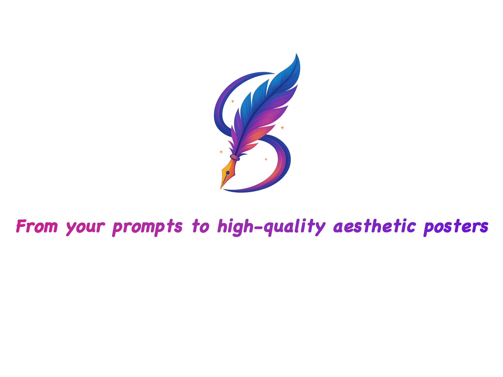

### [**🌐 Website**](https://ephemeral182.github.io/PosterCraft/) | [**🎯 Demo**](https://ephemeral182.github.io/PosterCraft/) | [**📄 Paper**](https://arxiv.org/abs/XXXX) | [**🤗 Models**](https://huggingface.co/PosterCraft) | [**📚 Datasets**](https://huggingface.co/datasets/PosterCraft) | [**🎥 Video**](#)

</div>

---

## News & Updates


- 🚀 **[2025.06]** Our live demo and inference code are now available!
- 📊 **[2025.06]** We have released partial datasets and model weights on HuggingFace.

---

## 👥 Authors

> [**Sixiang Chen**](https://ephemeral182.github.io/)<sup>1,2</sup>\*, [**Jianyu Lai**](https://openreview.net/profile?id=~Jianyu_Lai1)<sup>1</sup>\*, [**Jialin Gao**](https://scholar.google.com/citations?user=sj4FqEgAAAAJ&hl=zh-CN)<sup>2</sup>\*, [**Tian Ye**](https://owen718.github.io/)<sup>1</sup>, [**Haoyu Chen**](https://haoyuchen.com/)<sup>1</sup>, [**Hengyu Shi**](https://openreview.net/profile?id=%7EHengyu_Shi1)<sup>2</sup>, [**Shitong Shao**](https://shaoshitong.github.io/)<sup>1</sup>, [**Yunlong Lin**](https://scholar.google.com.hk/citations?user=5F3tICwAAAAJ&hl=zh-CN)<sup>3</sup>, [**Song Fei**](https://openreview.net/profile?id=~Song_Fei1)<sup>1</sup>, [**Zhaohu Xing**](https://ge-xing.github.io/)<sup>1</sup>, [**Yeying Jin**](https://jinyeying.github.io/)<sup>4</sup>, **Junfeng Luo**<sup>2</sup>, [**Xiaoming Wei**](https://scholar.google.com/citations?user=JXV5yrZxj5MC&hl=zh-CN)<sup>2</sup>, [**Lei Zhu**](https://sites.google.com/site/indexlzhu/home)<sup>1,5</sup>†
>
> <sup>1</sup>The Hong Kong University of Science and Technology (Guangzhou)  
> <sup>2</sup>Meituan  
> <sup>3</sup>Xiamen University  
> <sup>4</sup>National University of Singapore  
> <sup>5</sup>The Hong Kong University of Science and Technology  
>
> \*Equal Contribution, †Corresponding Author

---

## 🌟 What is PosterCraft?

<div align="center">
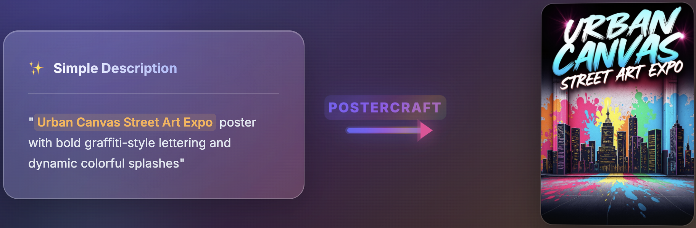
<br>
</div>

PosterCraft is a unified framework for **high-quality aesthetic poster generation** that excels in **precise text rendering**, **seamless integration of abstract art**, **striking layouts**, and **stylistic harmony**.


## 🚀 Quick Start

### 🔧 Installation

```bash
# Clone the repository
git clone https://github.com/ephemeral182/PosterCraft.git
cd PosterCraft

# Create conda environment
conda create -n postercraft python=3.11
conda activate postercraft

# Install dependencies
pip install -r requirements.txt

# Install PosterCraft
pip install -e .
```

### 🚀 Quick Generation

Generate high-quality aesthetic posters from your prompt with `BF16` precision:

```bash
python inference.py \
  --prompt "Urban Canvas Street Art Expo poster with bold graffiti-style lettering and dynamic colorful splashes" \
  --enable_recap \
  --num_inference_steps 28 \
  --guidance_scale 3.5 \
  --seed 42 \
  --pipeline_path "black-forest-labs/FLUX.1-dev" \
  --custom_transformer_path "PosterCraft/PosterCraft-v1_RL" \
  --qwen_model_path "Qwen/Qwen3-8B"
```

### 💻 Gradio Web UI

We provide a Gradio web UI for PosterCraft. 

```bash
python -m gradio poster_craft_web_ui.py
```


## 📊 Performance Benchmarks

<div align="center">

### 📈 Quantitative Results

<table>
<thead>
  <tr>
    <th>Method</th>
    <th>Text Recall ↑</th>
    <th>Text F-score ↑</th>
    <th>Text Accuracy ↑</th>
  </tr>
</thead>
<tbody>
  <tr>
    <td style="white-space: nowrap;">OpenCOLE (Open)</td>
    <td>0.082</td>
    <td>0.076</td>
    <td>0.061</td>
  </tr>
  <tr>
    <td style="white-space: nowrap;">Playground-v2.5 (Open)</td>
    <td>0.157</td>
    <td>0.146</td>
    <td>0.132</td>
  </tr>
  <tr>
    <td style="white-space: nowrap;">SD3.5 (Open)</td>
    <td>0.565</td>
    <td>0.542</td>
    <td>0.497</td>
  </tr>
  <tr>
    <td style="white-space: nowrap;">Flux1.dev (Open)</td>
    <td>0.723</td>
    <td>0.707</td>
    <td>0.667</td>
  </tr>
  <tr>
    <td style="white-space: nowrap;">Ideogram-v2 (Close)</td>
    <td>0.711</td>
    <td>0.685</td>
    <td>0.680</td>
  </tr>
  <tr>
    <td style="white-space: nowrap;">BAGEL (Open)</td>
    <td>0.543</td>
    <td>0.536</td>
    <td>0.463</td>
  </tr>
  <tr>
    <td style="white-space: nowrap;">Gemini2.0-Flash-Gen (Close)</td>
    <td>0.798</td>
    <td>0.786</td>
    <td>0.746</td>
  </tr>
  <tr>
    <td style="white-space: nowrap;"><b>PosterCraft (ours)</b></td>
    <td><b>0.787</b></td>
    <td><b>0.774</b></td>
    <td><b>0.735</b></td>
  </tr>
</tbody>
</table>


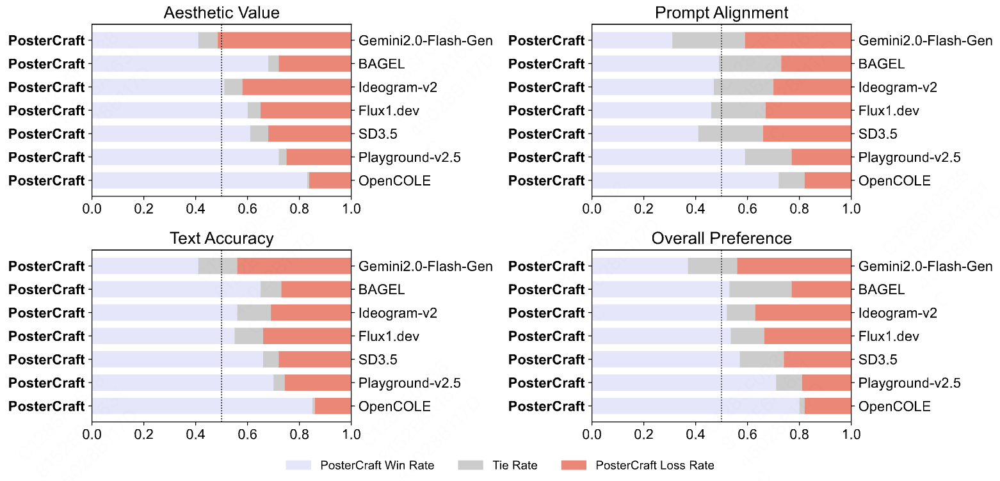

</div>

---

## 🎭 Gallery & Examples

<div align="center">

### 🎨 PosterCraft Gallery

<table>
<tr>
<td align="center">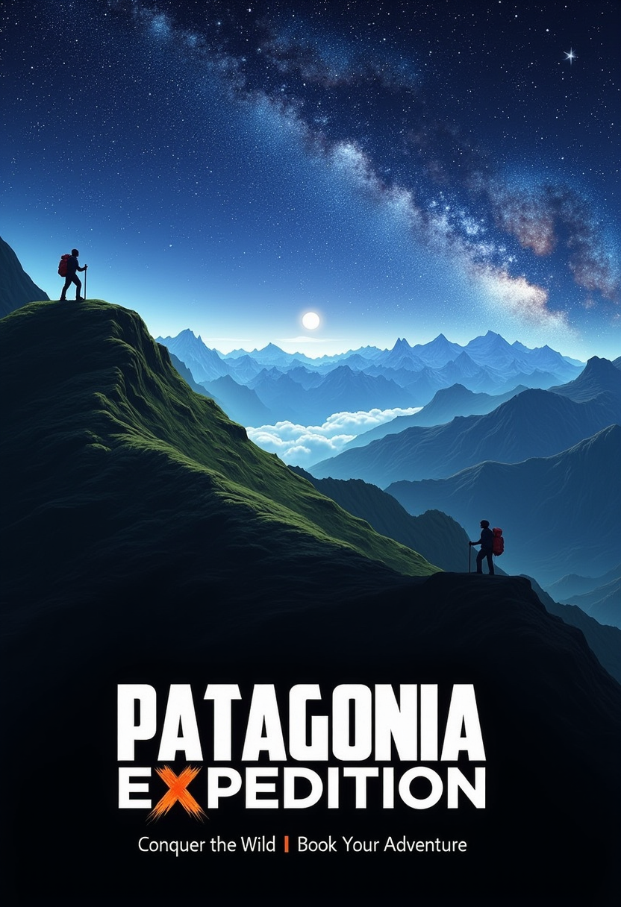<br><b>Adventure Travel</b></td>
<td align="center">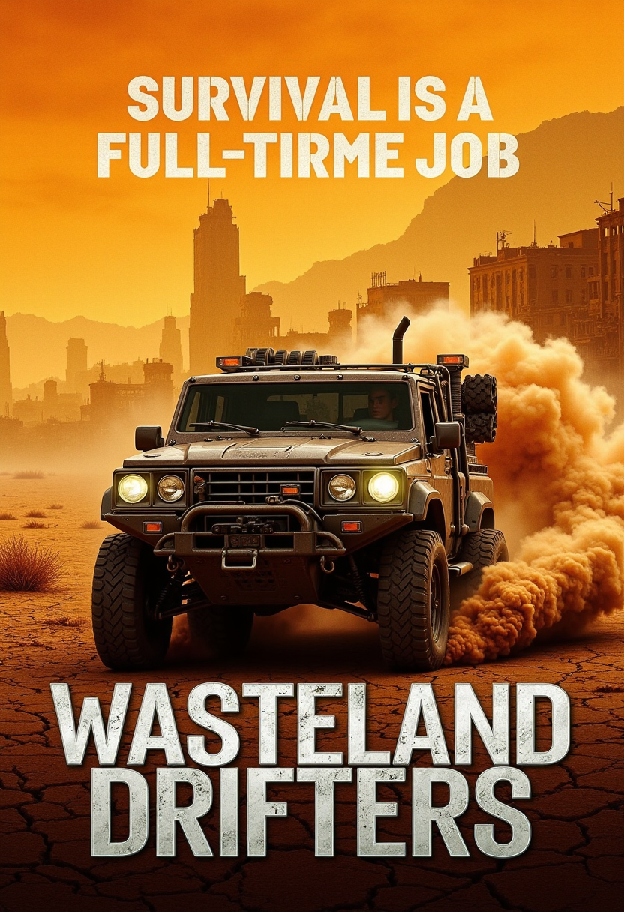<br><b>Post-Apocalyptic</b></td>
<td align="center">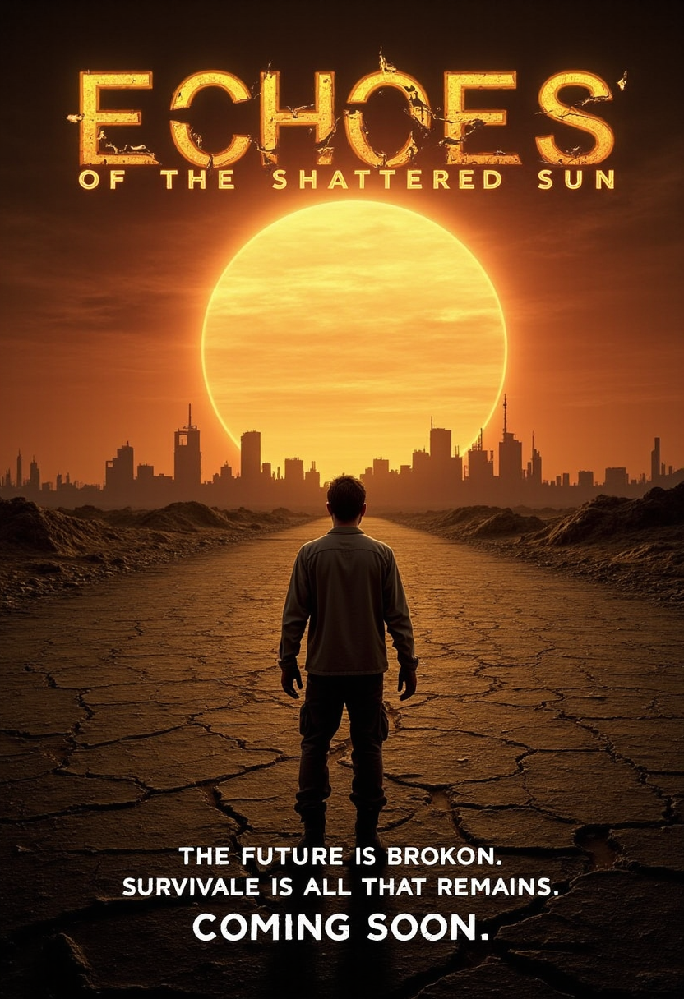<br><b>Sci-Fi Drama</b></td>
</tr>
<tr>
<td align="center">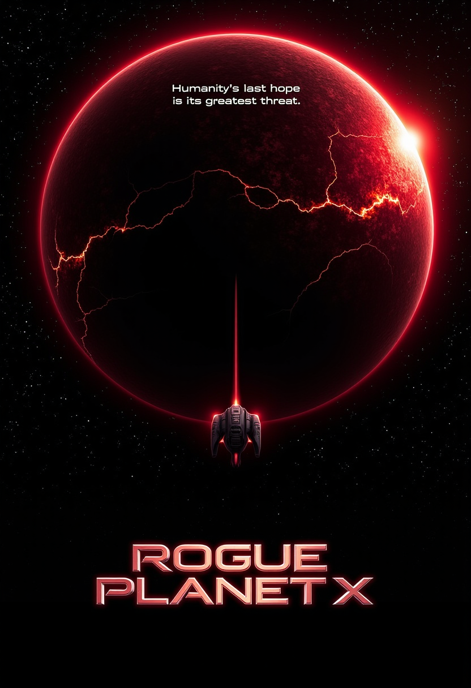<br><b>Space Thriller</b></td>
<td align="center"><br><b>Cultural Event</b></td>
<td align="center"><br><b>Luxury Product</b></td>
</tr>
<tr>
<td align="center">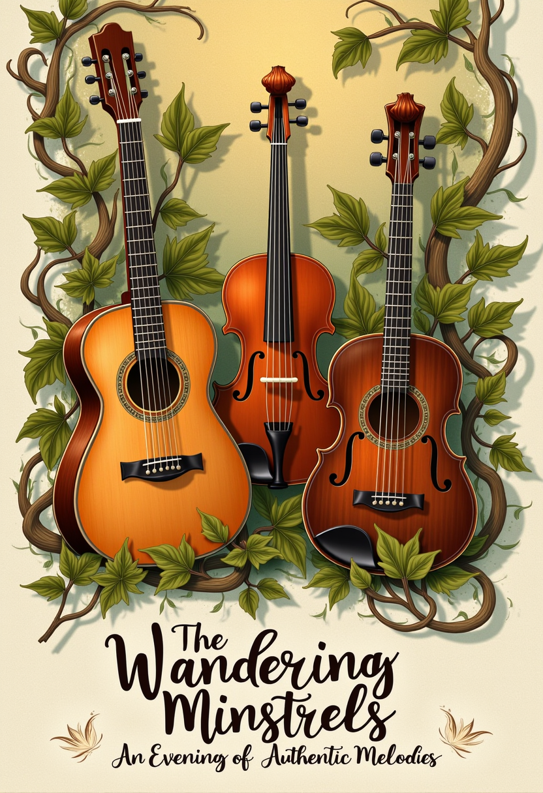<br><b>Concert Show</b></td>
<td align="center">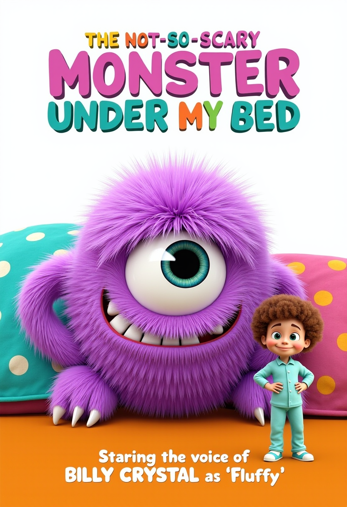<br><b>Children's Book</b></td>
<td align="center">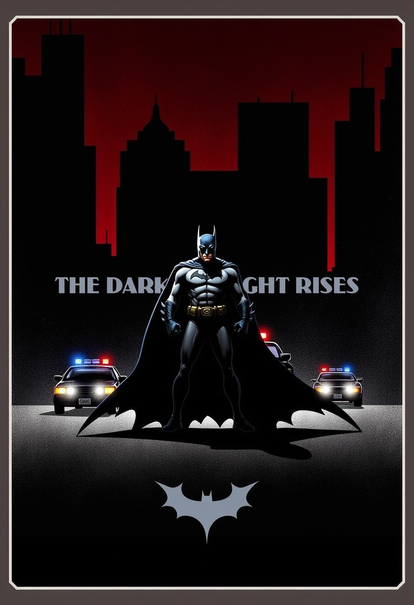<br><b>Movie Poster</b></td>
</tr>
</table>


</div>

---

## 🏗️ Model Architecture

<div align="center">
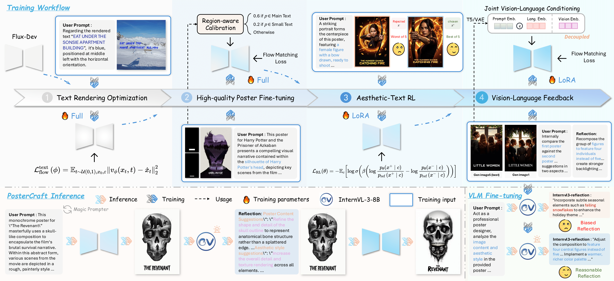
<br>
<em><strong>A unified framework for high-quality aesthetic poster generation</strong></em>
</div>

Our unified framework consists of **four critical optimization stages in the training workflow**:

### 🔤 Stage 1: Text Rendering Optimization
Addresses accurate text generation by precisely rendering diverse text on high-quality backgrounds, also ensuring faithful background representation and establishing foundational fidelity and robustness for poster generation.

### 🎨 Stage 2: High-quality Poster Fine-tuning  
Shifts focus to overall poster style and text-background harmony using Region-aware Calibration. This fine-tuning stage preserves text accuracy while strengthening the artistic integrity of the aesthetic poster.

### 🎯 Stage 3: Aesthetic-Text RL
Employs Aesthetic-Text Preference Optimization to capture higher-order aesthetic trade-offs. This reinforcement learning stage prioritizes outputs that satisfy holistic aesthetic criteria and mitigates defects in font rendering.

### 🔄 Stage 4: Vision-Language Feedback
Introduces a Joint Vision-Language Conditioning mechanism. This iterative feedback combines visual information with targeted text suggestions for multi-modal corrections, progressively refining aesthetic content and background harmony.

---

## 💾 Model Zoo

We provide the weights for our core models, fine-tuned at different stages of the PosterCraft pipeline.

<div align="center">
<table>
<tr>
<th>Model</th>
<th>Stage</th>
<th>Description</th>
<th>Download</th>
</tr>
<tr>
<td>🎯 <b>PosterCraft-v1_RL</b></td>
<td>Stage 3: Aesthetic-Text RL</td>
<td>Optimized via Aesthetic-Text Preference Optimization for higher-order aesthetic trade-offs.</td>
<td><a href="https://huggingface.co/PosterCraft/PosterCraft-v1_RL">🤗 HF</a></td>
</tr>
<tr>
<td>🔄 <b>PosterCraft-v1_Reflect</b></td>
<td>Stage 4: Vision-Language Feedback</td>
<td>Iteratively refined using vision-language feedback for further harmony and content accuracy.</td>
<td><a href="https://huggingface.co/PosterCraft/PosterCraft-v1_Reflect">🤗 HF</a></td>
</tr>
</table>
</div>

---

## 📚 Datasets


We provide **four specialized datasets** for training PosterCraft workflow:

### 🔤 Text-Render-2M
<div align="center">
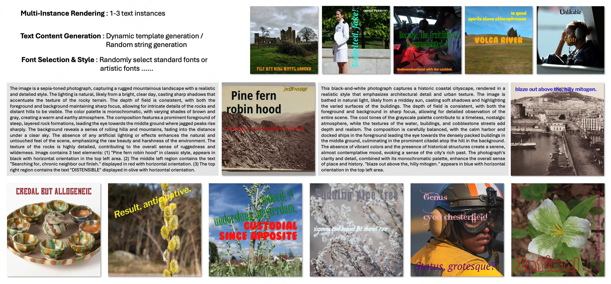
<br>
<em><strong>Text-Render-2M: Multi-instance text rendering with diverse selections</strong></em>
</div>

A comprehensive text rendering dataset containing **2 million high-quality examples**. Features multi-instance text rendering, diverse text selections (varying in size, count, placement, and rotation), and dynamic content generation through both template-based and random string approaches.

### 🎨 HQ-Poster-100K
<div align="center">
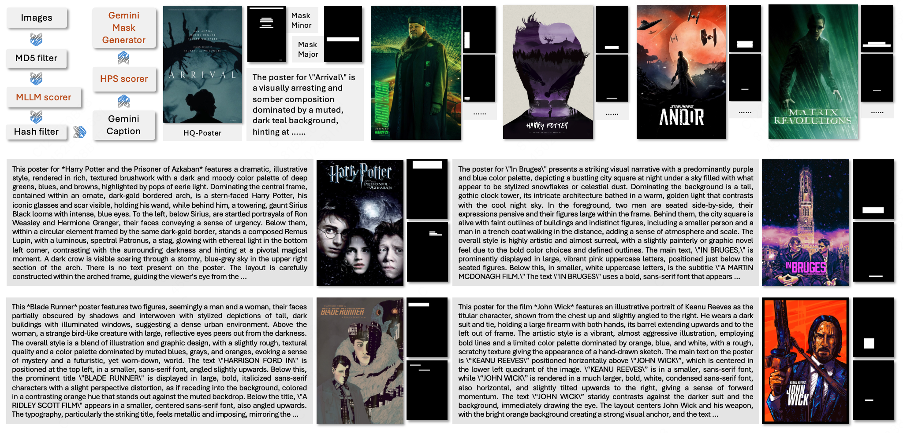
<br>
<em><strong>HQ-Poster-100K: Curated high-quality aesthetic posters</strong></em>
</div>

**100,000** meticulously curated high-quality posters with advanced filtering techniques and multi-modal scoring. Features Gemini-powered mask generation with detailed captions for comprehensive poster understanding.

### 👍 Poster-Preference-100K
<div align="center">
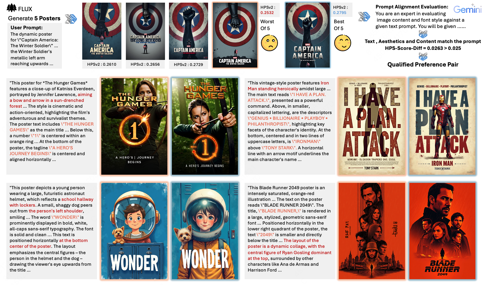
<br>
<em><strong>Poster-Preference-100K: Preference learning pairs for aesthetic optimization</strong></em>
</div>

**100,000** preference learning poster pairs with comprehensive evaluation by Gemini and aesthetic evaluators. Designed for human-aligned poster generation training through reinforcement learning.

### 🔄 Poster-Reflect-120K
<div align="center">
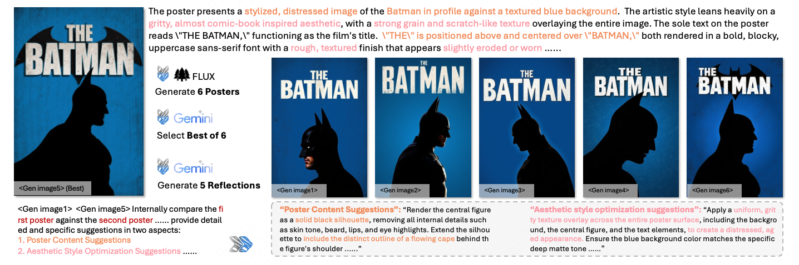
<br>
<em><strong>Poster-Reflect-120K: Vision-language feedback pairs for iterative refinement</strong></em>
</div>

**120,000** vision-language feedback pairs with comprehensive evaluation by Gemini and aesthetic evaluators. This dataset captures the iterative refinement process, and then provides detailed feedback for further improvements.

<div align="center">
<table>
<tr>
<th>Dataset</th>
<th>Size</th>
<th>Description</th>
<th>Download</th>
</tr>
<tr>
<td>🔤 <b>Text-Render-2M</b></td>
<td>2M samples</td>
<td>High-quality text rendering examples with multi-instance support</td>
<td><a href="https://huggingface.co/datasets/PosterCraft/Text-Render-2M">🤗 HF</a></td>
</tr>
<tr>
<td>🎨 <b>HQ-Poster-100K</b></td>
<td>100K samples</td>
<td>Curated high-quality posters with aesthetic evaluation</td>
<td><a href="https://huggingface.co/datasets/PosterCraft/HQ-Poster-100K">🤗 HF</a></td>
</tr>
<tr>
<td>👍 <b>Poster-Preference-100K</b></td>
<td>100K pairs</td>
<td>Preference learning poster pairs for RL training</td>
<td><a href="https://huggingface.co/datasets/PosterCraft/Poster-Preference-100K">🤗 HF</a></td>
</tr>
<tr>
<td>🔄 <b>Poster-Reflect-120K</b></td>
<td>120K pairs</td>
<td>Vision-language feedback pairs for iterative refinement</td>
<td><a href="https://huggingface.co/datasets/PosterCraft/Poster-Reflect-120K">🤗 HF</a></td>
</tr>
</table>
</div>

---

## 📝 Citation

If you find PosterCraft useful for your research, please cite our paper:

```bibtex
@article{chen2024postercraft,
  title={PosterCraft: Rethinking High-Quality Aesthetic Poster Generation in a Unified Framework},
  author={Chen, Sixiang and Lai, Jianyu and Gao, Jialin and Ye, Tian and Chen, Haoyu and Shi, Hengyu and Shao, Shitong and Lin, Yunlong and Fei, Song and Xing, Zhaohu and Jin, Yeying and Luo, Junfeng and Wei, Xiaoming and Zhu, Lei},
  journal={arXiv preprint arXiv:XXXX.XXXXX},
  year={2024}
}
```

---

## 🙏 Acknowledgments

- 🏛️ Thanks to our affiliated institutions for their support.
- 🤝 Special thanks to the open-source community for inspiration.

---

## 📬 Contact

For any questions or inquiries, please reach out to us:

- **Sixiang Chen**: `schen691@connect.hkust-gz.edu.cn`
- **Jianyu Lai**: `jlai218@connect.hkust-gz.edu.cn`


</div>
