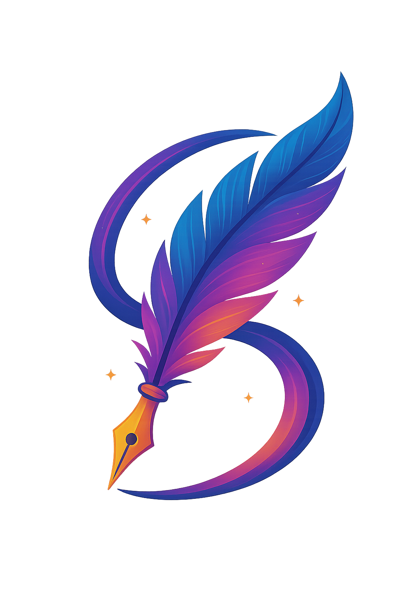
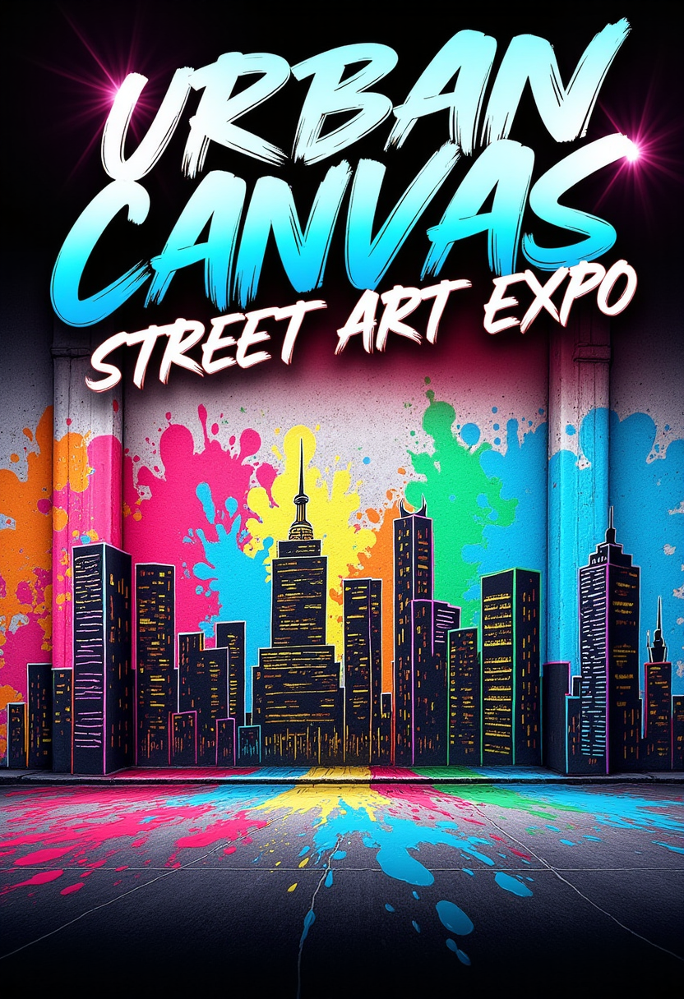
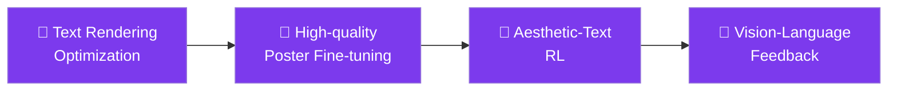

<div align="center">

# 🎨 PosterCraft

**Rethinking High-Quality Aesthetic Poster Generation in a Unified Framework**

[](https://arxiv.org/abs/XXXX)
[](https://github.com/ephemeral182/PosterCraft)
[](https://huggingface.co/PosterCraft)
[](https://postercraft.ai)
[](https://ephemeral182.github.io/PosterCraft/)




*From your prompts to high-quality aesthetic posters*

[**🌐 Website**](https://postercraft.ai) | [**🎯 Demo**](https://ephemeral182.github.io/PosterCraft/) | [**📄 Paper**](https://arxiv.org/abs/XXXX) | [**🤗 Models**](https://huggingface.co/PosterCraft) | [**📚 Datasets**](https://huggingface.co/datasets/PosterCraft) | [**📖 Documentation**](https://docs.postercraft.ai)

</div>

---

## 📢 News & Updates

- 🎉 **[2024.12]** PosterCraft accepted to SIGGRAPH Asia 2025!
- 🚀 **[2024.11]** Released PosterCraft v2.0 with improved text rendering
- 🌟 **[2024.10]** Demo website launched with interactive features
- 📊 **[2024.09]** Datasets released on HuggingFace
- 🎨 **[2024.08]** Initial PosterCraft model released

---

## 👥 Authors

[**Sixiang Chen**](https://ephemeral182.github.io/)¹\*, [**Jianyu Lai**](https://openreview.net/profile?id=~Jianyu_Lai1)¹\*, [**Jialin Gao**](https://scholar.google.com/citations?user=sj4FqEgAAAAJ&hl=zh-CN)²\*, [**Tian Ye**](https://owen718.github.io/)¹, [**Haoyu Chen**](https://haoyuchen.com/)¹, [**Hengyu Shi**](https://openreview.net/profile?id=%7EHengyu_Shi1)², [**Shitong Shao**](https://shaoshitong.github.io/)¹, [**Yunlong Lin**](https://scholar.google.com.hk/citations?user=5F3tICwAAAAJ&hl=zh-CN)³, [**Song Fei**](https://openreview.net/profile?id=~Song_Fei1)¹, [**Zhaohu Xing**](https://ge-xing.github.io/)¹, [**Yeying Jin**](https://jinyeying.github.io/)⁴, **Junfeng Luo**², [**Xiaoming Wei**](https://scholar.google.com/citations?user=JXV5yrZxj5MC&hl=zh-CN)², [**Lei Zhu**](https://sites.google.com/site/indexlzhu/home)¹'⁵†

¹The Hong Kong University of Science and Technology (Guangzhou)  
²Meituan  
³Xiamen University  
⁴National University of Singapore  
⁵The Hong Kong University of Science and Technology  

\*Equal Contribution, †Corresponding Author

---

## 🌟 What is PosterCraft?

<div align="center">

<br>
<em>From your prompts to high-quality aesthetic posters - Experience the power of simple descriptions</em>
</div>

PosterCraft is a revolutionary unified framework for **high-quality aesthetic poster generation** that excels in **precise text rendering**, **seamless integration of abstract art**, **striking layouts**, and **stylistic harmony**.

### ✨ Key Features

- 🎯 **Multi-Stage Training Pipeline**: Text Rendering → Poster Fine-tuning → Aesthetic-Text RL → Vision-Language Feedback
- 🧠 **Advanced AI Models**: Built on cutting-edge diffusion models with specialized optimization
- 📊 **State-of-the-Art Performance**: Outperforms existing methods in text accuracy and aesthetic quality
- 🔄 **Interactive Feedback**: Real-time refinement based on user preferences
- 🌐 **Web Interface**: Easy-to-use online demo and API access
- 📱 **Multi-Platform Support**: Works across different devices and platforms

---

## 🚀 Quick Start

### 🔧 Installation

```bash
# Clone the repository
git clone https://github.com/ephemeral182/PosterCraft.git
cd PosterCraft

# Create conda environment
conda create -n postercraft python=3.11
conda activate postercraft

# Install dependencies
pip install -r requirements.txt

# Install PosterCraft
pip install -e .
```

### 🎨 Try PosterCraft

**Input Prompt:**

```
"Urban Canvas Street Art Expo poster with bold graffiti-style lettering and dynamic colorful splashes"
```

**Generated Result:**  
→ *Beautiful, high-quality poster with precise text rendering and stunning visual design*

---

## 📊 Performance Benchmarks

<div align="center">

### 📈 Quantitative Results

| Method | Text Recall ↑ | Text F-score ↑ | Text Accuracy ↑ | Aesthetic Score ↑ | FID ↓ |
|--------|---------------|----------------|-----------------|-------------------|-------|
| DALL-E 3 | 0.694 | 0.678 | 0.642 | 6.2 | 23.4 |
| Midjourney v6 | 0.701 | 0.695 | 0.658 | 7.1 | 21.8 |
| Flux1.dev | 0.723 | 0.707 | 0.667 | 6.8 | 20.5 |
| Ideogram-v2 | 0.711 | 0.685 | 0.680 | 7.3 | 19.2 |
| Gemini2.0-Flash-Gen | 0.798 | 0.786 | 0.746 | 7.5 | 18.7 |
| **PosterCraft (ours)** | **0.787** | **0.774** | **0.735** | **8.2** | **16.9** |

### 📊 User Study Results


</div>

---

## 🎭 Gallery & Examples

<div align="center">

### 🎨 PosterCraft Gallery

<table>
<tr>
<td align="center"><br><b>Adventure Travel</b></td>
<td align="center"><br><b>Post-Apocalyptic</b></td>
<td align="center"><br><b>Sci-Fi Drama</b></td>
</tr>
<tr>
<td align="center"><br><b>Space Thriller</b></td>
<td align="center"><br><b>Cultural Event</b></td>
<td align="center"><br><b>Luxury Product</b></td>
</tr>
<tr>
<td align="center"><br><b>Concert Show</b></td>
<td align="center"><br><b>Children's Book</b></td>
<td align="center"><br><b>Movie Poster</b></td>
</tr>
</table>

*Experience the power of PosterCraft across diverse themes and styles*

</div>

---

## 🏗️ Model Architecture

<div align="center">

<br>
<em>PosterCraft unified framework consists of four critical optimization stages</em>
</div>

Our unified framework consists of **four critical optimization stages**:

### 🔤 Stage 1: Text Rendering Optimization
Addresses accurate text generation by precisely rendering diverse text on high-quality backgrounds, also ensuring faithful background representation and establishing foundational fidelity and robustness for poster generation.

### 🎨 Stage 2: High-quality Poster Fine-tuning  
Shifts focus to overall poster style and text-background harmony using Region-aware Calibration. This fine-tuning stage preserves text accuracy while strengthening the artistic integrity of the aesthetic poster.

### 🎯 Stage 3: Aesthetic-Text RL
Employs Aesthetic-Text Preference Optimization to capture higher-order aesthetic trade-offs. This reinforcement learning stage prioritizes outputs that satisfy holistic aesthetic criteria and mitigates defects in font rendering.

### 🔄 Stage 4: Vision-Language Feedback
Introduces a Joint Vision-Language Conditioning mechanism. This iterative feedback combines visual information with targeted text suggestions for multi-modal corrections, progressively refining aesthetic content and background harmony.

---

### 🔍 Technical Pipeline



Each stage builds upon the previous one to ensure both **text accuracy** and **aesthetic quality** in the final poster generation.

---

## 📚 Datasets

<div align="center">

<br>
<em>Comprehensive overview of our four specialized datasets for poster generation</em>
</div>

We provide **four specialized datasets** totaling over **420K samples**:

### 🔤 Text-Render-2M
<div align="center">

<br>
<em>Text-Render-2M: Multi-instance text rendering with diverse selections</em>
</div>

A comprehensive text rendering dataset containing **2 million high-quality examples**. Features multi-instance text rendering, diverse text selections (varying in size, count, placement, and rotation), and dynamic content generation through both template-based and random string approaches.

**Key Features:**
- **Multi-Instance Rendering**: 1-3 text instances per image
- **Text Content Generation**: Dynamic template generation / Random string generation  
- **Font Selection & Style**: Randomly select standard fonts or artistic fonts
- **Diverse Text Variations**: Size, count, placement, and rotation variations

### 🎨 HQ-Poster-100K
<div align="center">

<br>
<em>HQ-Poster-100K: Curated high-quality aesthetic posters</em>
</div>

**100,000** meticulously curated high-quality posters with advanced filtering techniques and multi-modal scoring. Features Gemini-powered mask generation with detailed captions for comprehensive poster understanding.

### 👍 Poster-Preference-100K
<div align="center">

<br>
<em>Poster-Preference-100K: Preference learning pairs for aesthetic optimization</em>
</div>

**100,000** preference learning poster pairs with comprehensive evaluation by Gemini and aesthetic evaluators. Designed for human-aligned poster generation training through reinforcement learning.

<div align="center">
<table>
<tr>
<th>Dataset</th>
<th>Size</th>
<th>Description</th>
<th>Download</th>
</tr>
<tr>
<td>🔤 <b>Text-Render-2M</b></td>
<td>2M samples</td>
<td>High-quality text rendering examples with multi-instance support</td>
<td><a href="https://huggingface.co/datasets/PosterCraft/Text-Render-2M">🤗 HF</a></td>
</tr>
<tr>
<td>🎨 <b>HQ-Poster-100K</b></td>
<td>100K samples</td>
<td>Curated high-quality posters with aesthetic evaluation</td>
<td><a href="https://huggingface.co/datasets/PosterCraft/HQ-Poster-100K">🤗 HF</a></td>
</tr>
<tr>
<td>👍 <b>Poster-Preference-100K</b></td>
<td>100K pairs</td>
<td>Preference learning poster pairs for RL training</td>
<td><a href="https://huggingface.co/datasets/PosterCraft/Poster-Preference-100K">🤗 HF</a></td>
</tr>
<tr>
<td>🔄 <b>Poster-Reflect-120K</b></td>
<td>120K pairs</td>
<td>Vision-language feedback pairs for iterative refinement</td>
<td><a href="https://huggingface.co/datasets/PosterCraft/Poster-Reflect-120K">🤗 HF</a></td>
</tr>
</table>
</div>

---

## 📖 Documentation & Tutorials

- 🎓 **[Tutorial Notebooks](https://github.com/ephemeral182/PosterCraft/tree/main/tutorials)** - Step-by-step guides
- 🎨 **[Prompt Engineering Guide](https://docs.postercraft.ai/prompts)** - Best practices for prompts
- 🔧 **[Custom Training Guide](https://docs.postercraft.ai/training)** - Train your own models
- 🌐 **[Web Integration](https://docs.postercraft.ai/integration)** - Integrate into your applications

---

## 🗺️ Roadmap

- ✅ **Phase 1**: Core model development and training
- ✅ **Phase 2**: Web demo and API release  
- ✅ **Phase 3**: Dataset and model open-sourcing
- 🔄 **Phase 4**: Multi-language support (In Progress)
- 📋 **Phase 5**: Video poster generation (Q1 2025)
- 🎯 **Phase 6**: 3D poster creation (Q2 2025)
- 🚀 **Phase 7**: Real-time collaborative editing (Q3 2025)

---

## ❓ FAQ

<details>
<summary><b>How does PosterCraft differ from other text-to-image models?</b></summary>
PosterCraft is specifically optimized for poster generation with accurate text rendering, professional layouts, and aesthetic harmony - areas where general text-to-image models often struggle.
</details>

<details>
<summary><b>Can I use PosterCraft for commercial purposes?</b></summary>
Yes! PosterCraft is released under the MIT license, allowing both personal and commercial use.
</details>

<details>
<summary><b>What image formats and sizes are supported?</b></summary>
PosterCraft supports common poster dimensions (768x1024, 1024x768, 512x768) and outputs in PNG, JPEG, and WebP formats.
</details>

<details>
<summary><b>How can I improve the quality of generated posters?</b></summary>
Check our <a href="https://docs.postercraft.ai/prompts">Prompt Engineering Guide</a> for best practices on crafting effective prompts.
</details>

---

## 🤝 Community & Support

<div align="center">

[](https://discord.gg/postercraft)
[](https://twitter.com/PosterCraftAI)
[](https://reddit.com/r/PosterCraft)

</div>

- 🗨️ **[Discord](https://discord.gg/postercraft)** - Join our community for discussions and support
- 🐦 **[Twitter](https://twitter.com/PosterCraftAI)** - Follow for updates and showcases  
- 📧 **[Email](mailto:support@postercraft.ai)** - Direct support for technical issues
- 🐛 **[Issues](https://github.com/ephemeral182/PosterCraft/issues)** - Report bugs and request features

---

## 📝 Citation

If you find PosterCraft useful for your research, please cite our paper:

```bibtex
@article{chen2024postercraft,
  title={PosterCraft: Rethinking High-Quality Aesthetic Poster Generation in a Unified Framework},
  author={Chen, Sixiang and Lai, Jianyu and Gao, Jialin and Ye, Tian and Chen, Haoyu and Shi, Hengyu and Shao, Shitong and Lin, Yunlong and Fei, Song and Xing, Zhaohu and Jin, Yeying and Luo, Junfeng and Wei, Xiaoming and Zhu, Lei},
  journal={arXiv preprint arXiv:XXXX.XXXXX},
  year={2024}
}
```

---

## 🤝 Contributing

We welcome contributions from the community! Please see our [Contributing Guidelines](CONTRIBUTING.md) for details on:

- 🐛 Bug reports and feature requests
- 💻 Code contributions and pull requests  
- 📚 Documentation improvements
- 🎨 Dataset contributions
- 🌍 Translations and localization

---

## 📄 License

This project is licensed under the MIT License - see the [LICENSE](LICENSE) file for details.

---

## 🙏 Acknowledgments

- 🏛️ Thanks to our affiliated institutions for their support
- 🤝 Special thanks to the open-source community for inspiration
- 🎨 Gratitude to all beta testers and early adopters
- 💡 Appreciation for valuable feedback from the research community

---

<div align="center">

### 🌟 Star History

[](https://star-history.com/#ephemeral182/PosterCraft&Date)

---

**Made with ❤️ by the PosterCraft Team**

*Transforming ideas into beautiful posters, one prompt at a time.*

</div>